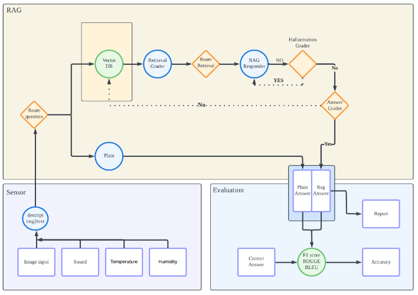
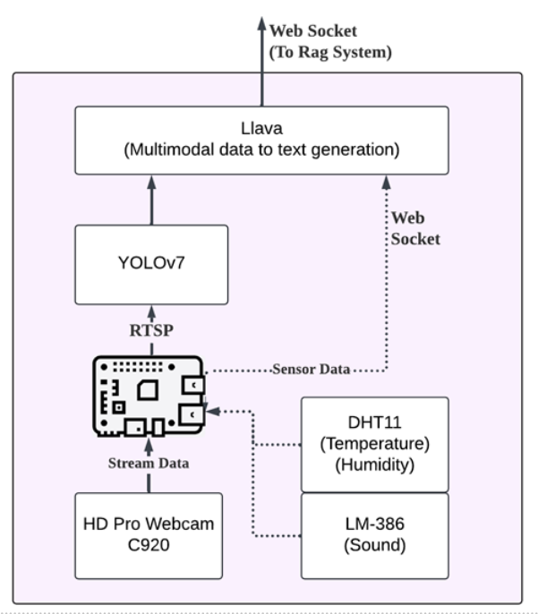

# sentiQ
SentIQ is an intelligent security system that combines RAG, LLM, and sensor data to detect threats, monitor behaviors, and generate alerts for enhanced safety.

## Prerequisite
- `Ubuntu 24.04`
- `NVIDIA Corporation AD102 [GeForce RTX 4090] 24GB vRAMRTX 4090`
- `nvcc --version: Cuda compilation tools, release 12.6, V12.6.77`
若要使用本地模型需要先安裝 [LM Studio](https://lmstudio.ai/) 在需要手動下載要執行的本地模型權重 `.gguf`。

## Quick Usage
為了省去本地大型語言模型的建置時間，目前測試是使用 openai API 以加速功能的開發，openai API key 與 websearch API key 不能上傳 github，請去開發文件中查閱。
將開發文件中的 openai API key 複製到 `config.py` 中。
使用 `conda` 建立虛擬環境，並使用以下命令安裝環境：
```
$ pip install -r requirements.txt
```
使用以下命令進行簡單的測試：
```
$ python3 main.py -f rag
```

如果要使用完整功能需要連結 sensor 部份實作，sensor 與 LLM 之間是使用 `websocket` 傳輸，並使用 `line notify` 傳輸危險報告書通報使用者，其中包括現場描述，應對措施與 `unity` 圖片。
```
$ python3 run.py
```
需要先確定 `websocket` 所設定之 `IP` 與 `port`。注意 `line notify` 功能支援截止日期。

## Structure


`github` 中只有收錄 LLM 與 RAG 的部份



## githook
執行命令 `bash setup-hooks.sh` 來啟動 git hook，在每次 commit 時執行以下內容：
- 自動排版 git commit message
- 自動排版 python 程式
- 自動清除 API key
